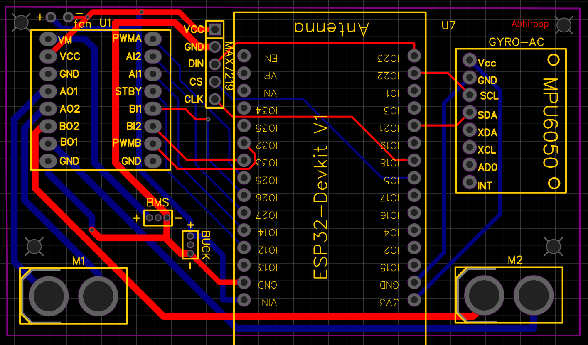

# ESP32 Self-Balancing Robot

A self-balancing two-wheeled robot built using an ESP32, MPU6050 IMU, and PID control.  
The robot balances upright, responds to Bluetooth commands, and allows real-time PID tuning without reflashing firmware.



---

## 🌟 Features

- **Real-time balancing** using MPU6050 and PID control
- **Bluetooth control** for movement (forward, backward, left, right, stop)
- **Live PID tuning** via Bluetooth commands
- **Automatic fall detection** with motor cutoff
- **Smooth acceleration** and direction transitions
- **TB6612FNG motor driver** for reliable motor control
- **Optional LED matrix** for status display

---

## 🛠 Hardware Setup

### Components Required

| Component | Quantity | Purpose |
|-----------|----------|---------|
| ESP32 Dev Board | 1 | Main controller |
| TB6612FNG Motor Driver | 1 | Dual H-bridge motor control |
| MPU6050 IMU | 1 | Gyroscope + Accelerometer |
| DC Gear Motors (300 RPM) | 2 | Wheel drive |
| 18650 Li-ion Battery (3S) | 3 | Power supply |
| 3S BMS | 1 | Battery protection |
| DC-DC Buck Converter | 1 | 12V → 5V conversion |
| 10cm Rubber Wheels | 2 | Traction |
| ON/OFF Switch | 1 | Power control |

### Wiring Diagram

```
ESP32              TB6612FNG              MPU6050
------              --------              -------
GPIO14  --------->  PWMA       VM   ----->  12V
GPIO27  --------->  AIN1       VCC  ----->  5V
GPIO26  --------->  AIN2       GND  ----->  GND
GPIO25  --------->  PWMB       SDA  ----->  GPIO21
GPIO33  --------->  BIN1       SCL  ----->  GPIO22
GPIO32  --------->  BIN2
GPIO12  --------->  STBY

MOTOR A  <------>  Left Motor
MOTOR B  <------>  Right Motor
```

---

## 🔧 Installation

### 1. Software Requirements

- [Arduino IDE](https://www.arduino.cc/en/software) (version 1.8+)
- ESP32 Board Support
- Required Libraries:
  - `MPU6050_tockn` by Tockn
  - `BluetoothSerial`

### 2. Install ESP32 Board Support

1. Open Arduino IDE
2. Go to `File` → `Preferences`
3. Add to Additional Boards Manager URLs:
   ```
   https://raw.githubusercontent.com/espressif/arduino-esp32/gh-pages/package_esp32_index.json
   ```
4. Go to `Tools` → `Board` → `Boards Manager`
5. Search for `esp32` and install

### 3. Install Libraries

1. Go to `Tools` → `Manage Libraries`
2. Search for `MPU6050_tockn` and install
3. Search for `BluetoothSerial` (usually comes with ESP32 board package)

### 4. Upload Code

1. Clone this repository
2. Open `firmware/esp32_balancing_bot_bt.ino`
3. Select Board: `ESP32 Dev Module`
4. Select correct COM port
5. Click `Upload`

---

## 🚀 Usage

### Initial Setup

1. Power on the robot
2. Place robot upright on a flat surface
3. Wait for MPU6050 calibration (do not move robot during this time)
4. The robot should start balancing automatically

### Connecting via Bluetooth

1. On your phone/computer, scan for Bluetooth devices
2. Connect to `ESP32_BalancingBot`
3. Use a serial terminal app (like Serial Bluetooth Terminal for Android)
4. Default PIN: `1234` (if required)

---

## 📡 Bluetooth Commands

### Movement Commands

| Command | Action |
|---------|--------|
| `F` | Move Forward |
| `B` | Move Backward |
| `L` | Turn Left |
| `R` | Turn Right |
| `S` | Stop |

### PID Tuning Commands

```
SET KP 20.5    # Set Proportional gain
SET KI 0.02    # Set Integral gain
SET KD 2.3     # Set Derivative gain
SET SP -4.0    # Set Balance Setpoint
```

### Status Commands

```
GET PID        # Get current PID values
GET ANGLE      # Get current tilt angle
GET BATTERY    # Get battery voltage
```

---

## ⚙ PID Configuration

### Recommended Starting Values

| Parameter | Value | Description |
|-----------|-------|-------------|
| Kp | 20.0 | Proportional gain (response speed) |
| Ki | 0.01 | Integral gain (eliminate steady-state error) |
| Kd | 2.0 | Derivative gain (damping) |
| Setpoint | -4.0 | Target balance angle (negative = slight forward lean) |

### Tuning Tips

1. **Start with Kp only** (Ki=0, Kd=0)
2. Increase Kp until robot oscillates, then reduce by 30%
3. Add Kd to reduce oscillations
4. Add small Ki if robot drifts from setpoint
5. Adjust setpoint for desired forward/backward lean

---

## 🐛 Troubleshooting

### Common Issues

| Problem | Possible Solution |
|---------|------------------|
| Robot doesn't balance | Check MPU6050 wiring, ensure flat surface during startup |
| Motors vibrate/shake | Reduce Kp, increase Kd |
| Robot drifts forward/backward | Adjust setpoint value |
| Bluetooth not connecting | Check if Bluetooth is enabled in code, restart ESP32 |
| Motors overheat | Reduce PWM limits, check battery voltage |

### Serial Debug Output

Open Serial Monitor (115200 baud) to see:
- MPU6050 calibration status
- Current angle readings
- PID calculations
- Motor outputs

---

## 📁 Project Structure

```
esp32-self-balancing-robot/
├── firmware/
│   └── esp32_balancing_bot_bt.ino  # Main Arduino sketch
├── hardware/
│   ├── images/                     # Robot photos
│   ├── schematics/                 # Circuit diagrams
│   └── 3d-models/                  # Chassis designs (if any)
├── documentation/
│   ├── pid-tuning-guide.md        # Detailed PID tuning
│   └── assembly-guide.md          # Step-by-step build
└── README.md                       # This file
```

---

## 🚀 Future Enhancements

- [ ] **Mobile App Interface** for easier control
- [ ] **Obstacle Avoidance** with ultrasonic sensors
- [ ] **Wi-Fi Control** via web interface
- [ ] **Data Logging** for performance analysis
- [ ] **3D-Printed Chassis** for better aesthetics
- [ ] **OTA Updates** for wireless firmware updates

---

## 📄 License

This project is licensed under the MIT License - see the [LICENSE](LICENSE) file for details.

---

## 👤 Author

**Abhiroop Sanil**  
- Email: abhiroopsanil24@gmail.com

---


## ⭐ Support

If you find this project helpful, please give it a star! ⭐

---

**Happy Building!** 🚀🤖
